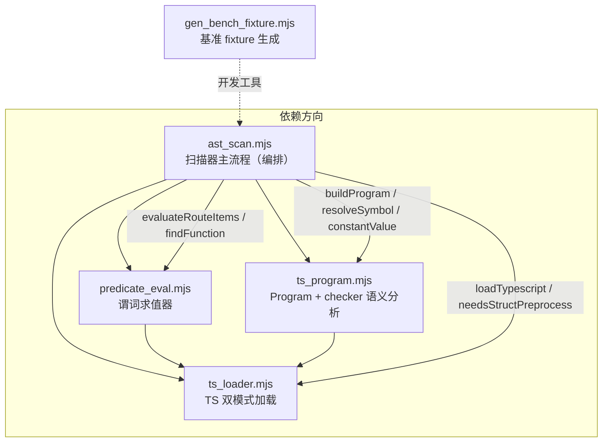
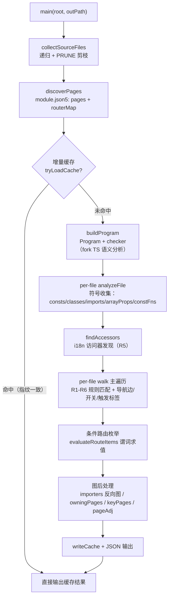
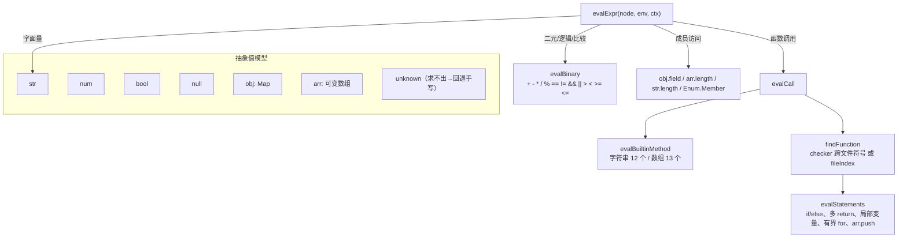
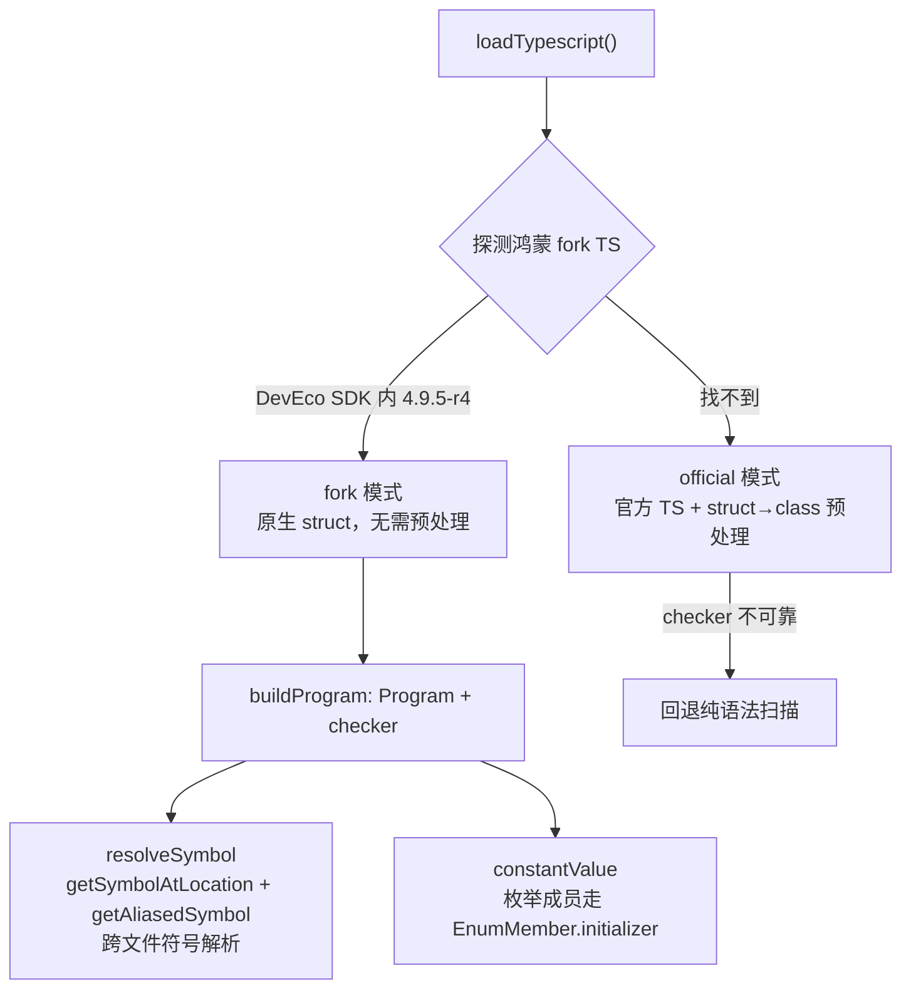
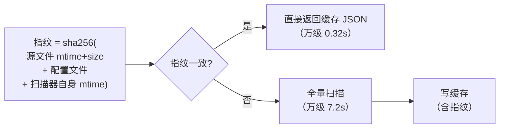

# tools/ 技术架构

> 静态扫描引擎（AST 后端）的技术架构说明。对应 Python 侧 `autoshot/scanner.py` 的 ast 后端。

## 一、模块总览与依赖关系

`tools/` 下共 5 个文件，全部为 ESM（`.mjs`），Node 运行。

| 文件 | 职责 | 定位 |
|---|---|---|
| `ast_scan.mjs` | **扫描器主流程**（CLI 入口）：文件/页面发现、符号收集、R1-R6 规则匹配、上下文分类、条件路由枚举、增量缓存、JSON 输出 | 编排层 |
| `predicate_eval.mjs` | **谓词求值器**（抽象解释器）：对同步可求值的条件表达式/函数体做抽象求值 | 执行语义层 |
| `ts_program.mjs` | **语义分析封装**：TS `Program` + `checker`，跨文件符号解析、枚举常量求值 | 类型/符号层 |
| `ts_loader.mjs` | **TS 加载器**：双模式（鸿蒙 fork TS 优先 / 官方 TS 回退） | 基础设施 |
| `gen_bench_fixture.mjs` | **基准 fixture 生成器**：造千/万级文件测试性能 | 开发工具 |

## 二、扫描主流程（ast_scan.mjs 的 main）

## 三、规则匹配（R1-R6）

| 规则 | 代码形态 | 说明 |
|---|---|---|
| R1 | `$r('app.string.key')` | 字面量，100% 静态解析 |
| R2 | `getStringSync($r('app.string.key').id)` | id 换取 |
| R3 | `getStringByNameSync('key')` | 按名字面量 |
| R4 | `getStringByNameSync(this.keyName)` | 常量传播（1 层 + 跨文件 import） |
| R5 | `I18n.t('login_title')` | 函数摘要（访问器识别 + 回溯调用点） |
| R6 | `MAP[type].key` | 查表（常量对象/数组） |

上下文分类（classify）：`visible` / `conditional`（含条件源码）/ `click`（Dialog/Toast）/ `runtime`（onXxx 回调、catch 分支）。

## 四、谓词求值器（predicate_eval.mjs）

抽象解释器，用抽象值对同步纯函数做运行时求值。

**能力边界**：同步可求值的条件形态（字面量、纯函数、多语句函数体、函数返回数组、跨文件 import、枚举常量、对象数组）；超出子集（递归、无界循环、异步数据、副作用）→ 返回 `unknown` → 调用方回退手写 scenes.yaml。

## 五、TS 双模式 + 语义分析

- **`.ets` 后缀模块解析**：自定义 `resolveModuleNames`（TS 默认只试 `.ts/.tsx/.d.ts`）。
- **枚举常量求值**：`checker.getConstantValue` 对枚举成员返回 `undefined`，需走符号路径（`resolveSymbol` → `EnumMember.initializer` 递归求值）。
- **仅 fork 模式可做语义分析**；官方模式降级为纯语法扫描（枚举/跨文件常量符号解析不可用）。

## 六、增量缓存（P5）

**关键设计**：指纹纳入**扫描器自身版本**（ast_scan/predicate_eval/ts_program/ts_loader 的 mtime），避免工具升级后旧缓存返回过时结果。

## 七、性能基线（10001 文件实测）

| 阶段 | 耗时 | 占比 | 可并行? |
|---|---|---|---|
| createProgram + checker | 4.1s | 57% | ❌ checker 全局单例 |
| 主遍历（规则匹配+求值） | ~3s | 42% | ⚠️ 依赖 checker |
| 缓存命中 | 0.32s | — | — |

**结论**：语义分析（57%）是 checker 单例不可并行；并行解析收益低复杂度高，不做。增量缓存已解决"老项目反复扫描"的核心诉求。
